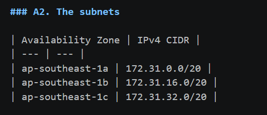
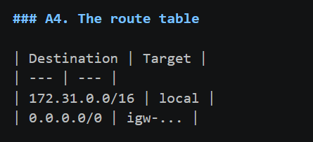
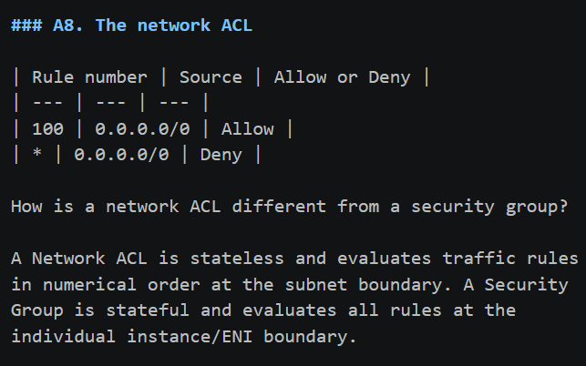
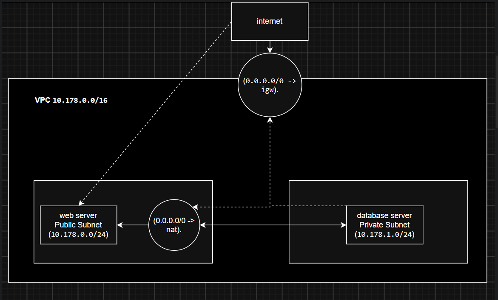

# Assignment 2 Submission

## About me

- GitHub username: VobAviso
- Section: ccsad
- IAM user name that I signed in with: ccsad-g07
- X: 178

---

## Part A. Explore

### A1. The VPC

Default VPC IPv4 CIDR:

172.31.0.0/16

Number of addresses in that CIDR:

65536

### A2. The subnets

| Availability Zone | IPv4 CIDR |
| --- | --- |
| ap-southeast-1a | 172.31.0.0/20 |
| ap-southeast-1b | 172.31.16.0/20 |
| ap-southeast-1c | 172.31.32.0/20 |

Screenshot 1. Save it as `screenshot-1-subnets.png` in your folder. The image line below shows it.

### A3. Available addresses

Available IPv4 addresses in each subnet:

4091 in each default subnet (or as shown in your AWS console)

Why is the number lower than 4,096?

AWS automatically reserves 5 IP addresses in every subnet for networking purposes (network address, VPC router, Amazon DNS, future reservation, and network broadcast address).

What uses the missing address in the subnet with the lowest number?

Active network resources deployed in that subnet, such as EC2 instances, Elastic Network Interfaces (ENIs), or Load Balancers.

### A4. The route table

| Destination | Target |
| --- | --- |
| 172.31.0.0/16 | local |
| 0.0.0.0/0 | igw-... |

Screenshot 2. Save it as `screenshot-2-routes.png` in your folder. The image line below shows it.

### A5. Public or private

Are the default subnets public or private? Which route proves it?

The default subnets are public. The route with destination `0.0.0.0/0` targeted to the Internet Gateway (`igw-...`) proves it.

### A6. The internet gateway

State of the internet gateway:

Attached

What happens to the default subnets if the gateway is detached?

Instances inside the subnets will lose direct inbound and outbound internet access, causing the subnets to behave as private subnets.

### A7. NAT gateways

Number of NAT gateways:

0

Can a server in a new private subnet download updates? Why?

No. There is no NAT Gateway configured to translate and route outbound traffic from the private subnet to the internet.

### A8. The network ACL

| Rule number | Source | Allow or Deny |
| --- | --- | --- |
| 100 | 0.0.0.0/0 | Allow |
| * | 0.0.0.0/0 | Deny |

How is a network ACL different from a security group?

A Network ACL is stateless and evaluates traffic rules in numerical order at the subnet boundary. A Security Group is stateful and evaluates all rules at the individual instance/ENI boundary.

Screenshot 3. Save it as `screenshot-3-network-acl.png` in your folder. The image line below shows it.

### A9. The default security group

Inbound rule (type and source):

Type: All traffic | Source: default security group ID (self-referencing)

Which resources can send traffic to an instance that uses it?

Other network interfaces or instances assigned to the same `default` security group.

---

## Part B. Prepare

### B1. Plan two subnets

- Public subnet CIDR: 10.178.0.0/24
- Private subnet CIDR: 10.178.1.0/24

### B2. Route tables

Route table of the public subnet:

| Destination | Target |
| --- | --- |
| 10.178.0.0/16 | local |
| 0.0.0.0/0 | internet gateway |

Route table of the private subnet:

| Destination | Target |
| --- | --- |
| 10.178.0.0/16 | local |
| 0.0.0.0/0 | NAT gateway |

### B3. My VPC diagram

Tool used (Excalidraw, draw.io, Lucidchart, or paper):

Excalidraw

Save your diagram as `vpc-diagram.png` in your folder. The image line below shows it.

### B4. Predict a change

Can you still open the web page from your laptop? Why?

No. Deleting the `0.0.0.0/0` route removes the path to the Internet Gateway, preventing public web traffic from reaching or returning from the instance.

Can the instance still reach another instance in the VPC? Why?

Yes. Communication within the VPC is handled by the `10.178.0.0/16 -> local` route, which is unaffected by removing the internet route.

### B5. Place a database

Which subnet gets the database? Why?

The private subnet. Placing the database in the private subnet hides it from direct internet exposure while keeping it accessible to backend web servers in the public subnet.

### B6. My question about VPCs

What is your question, and what made you think of it?

How does AWS handle IP address conflicts if two VPCs with overlapping CIDRs need to be connected via VPC Peering? I thought of this because both subnets in this assignment use private IPv4 spaces that could overlap across different AWS environments.